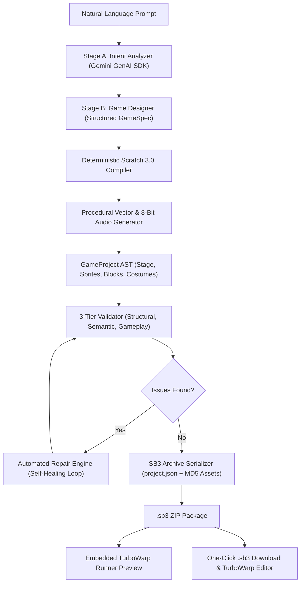

# AI Scratch Game Builder

A production-grade, full-stack application that transforms natural language game descriptions into real, playable Scratch 3.0 & TurboWarp-compatible `.sb3` projects.

Powered by Google Gemini structured generation, a deterministic Scratch AST compiler, a procedural vector asset pipeline, a 3-tier validation engine with self-healing auto-repair, and an embedded TurboWarp runner.

---

## Key Features

- **Natural Language to Real `.sb3`**:
  Turn prompts like:
  > *"Create a polished platformer with a player, double jump, coins, enemies, checkpoints, three levels, health, score, a game-over screen and a final boss."*
  into an actual, packaged `.sb3` project that opens directly in Scratch 3.0 and TurboWarp.

- **Multi-Stage AI Reasoning Pipeline**:
  - **Stage A — Intent Analyzer**: Extracts genre, camera model, entities, difficulty, levels, and mechanics.
  - **Stage B — Game Designer**: Synthesizes a structured `GameSpec` matching a strict schema.
  - **Stage C — Deterministic Compiler**: Builds rock-solid Scratch block hierarchies, eliminating hallucinations and broken block pointers.
  - **Stage D — 3-Tier Validator**: Enforces structural, semantic, and gameplay rules.
  - **Stage E — Self-Healing Repair**: Automatically resolves missing variables, orphan broadcasts, or missing assets up to `MAX_REPAIR_ATTEMPTS = 3`.

- **Project-Aware AI Chat & AST Patch System**:
  Continue chatting with the AI to incrementally modify the project without regenerating from scratch:
  - *"Add 5 more enemies"*
  - *"Make the player jump higher"*
  - *"Add a 2x score multiplier"*
  - *"Make the player faster"*

- **In-App TurboWarp Runner Preview**:
  Play your generated game directly in the browser via an embedded standalone runner with Green Flag, Stop, Restart, and Fullscreen controls.

- **Import & Project Analyzer**:
  Upload any existing `.sb3` file to parse its structure, inspect statistics (sprites, costumes, scripts, variables, broadcasts), and modify it using natural language.

- **Procedural Vector & Audio Synthesis**:
  Generates crisp SVG vector sprites, backgrounds, UI banners, and 8-bit WAV sound effects (jump, coin, hit, shoot, explosion, win, game over) with compliant MD5 asset hashing.

---

## Architecture Overview



---

## Prerequisites

- **Node.js**: v18.0.0 or higher (Node 20+ recommended)
- **npm**: v9.0.0 or higher
- **Google Gemini API Key**: Obtain a key from [Google AI Studio](https://aistudio.google.com/)

---

## Installation & Setup

1. **Clone the repository and install dependencies**:
   ```bash
   npm install
   ```

2. **Configure Environment Variables**:
   Copy `.env.example` to `.env.local`:
   ```bash
   cp .env.example .env.local
   ```

   Edit `.env.local`:
   ```ini
   # Google Gemini API Key
   GEMINI_API_KEY=your_actual_gemini_api_key_here

   # Default Gemini Model
   GEMINI_MODEL=gemini-2.5-flash
   ```

   *(Note: You can also enter or override your API key directly inside the application UI via the **Settings** modal! The key is securely passed to backend API endpoints and never exposed to the client bundle.)*

---

## Development

Start the development server:
```bash
npm run dev
```

Open [http://localhost:3000](http://localhost:3000) in your browser.

---

## Production Build

To run the production build:
```bash
npm run build
npm run start
```

---

## Running the Automated Test Suite

Run all unit, integration, and end-to-end tests:
```bash
npm test
```

Or run Vitest in watch mode:
```bash
npm run test:watch
```

### Test Coverage Highlights:
- `tests/engine/blocks.test.ts`: Block AST factories, parent/next pointer stitching, reporter nesting.
- `tests/engine/serializer.test.ts`: `.sb3` ZIP archive generation, MD5 asset verification, Scratch 3.0 compliance.
- `tests/engine/importer.test.ts`: `.sb3` unpacking, metrics calculation, AST restoration.
- `tests/engine/mechanics.test.ts`: Platformer, Shooter, Clicker, and Top-down mechanics generators.
- `tests/validator/validator.test.ts`: Error detection for missing variables, orphan broadcasts, missing starters.
- `tests/validator/repair.test.ts`: Automated self-healing loop fixing semantic and structural bugs.
- `tests/patcher/patch-engine.test.ts`: Applying incremental AST patches (adding sprites, variables, tuning physics).
- `tests/e2e/generate-game.test.ts`: Complete end-to-end pipeline test from natural language prompt to valid `.sb3`.

---

## Project Structure

```
├── src/
│   ├── ai/
│   │   ├── compiler.ts            # Master GameSpec compiler to GameProject AST
│   │   ├── gemini.ts              # Gemini GenAI SDK client with fallback resilience
│   │   └── prompts/               # Centralized prompts (intent, designer, patcher, repairer)
│   ├── app/
│   │   ├── api/                   # Server routes (generate, modify, validate, repair, export, import, preview)
│   │   ├── globals.css            # Tailwind & Scratch block styles
│   │   ├── layout.tsx             # Root application layout
│   │   └── page.tsx               # Main application workspace (3-column layout)
│   ├── components/
│   │   ├── AIChat.tsx             # AI generation prompt, progress tracker & chat modifications
│   │   ├── GamePreview.tsx        # Embedded runner, block visualizer, costume gallery, JSON inspector
│   │   ├── Navbar.tsx             # Header with title, generation mode, export, and settings
│   │   ├── ProjectExplorer.tsx    # Tree view of targets, sprites, variables, and broadcasts
│   │   ├── SettingsModal.tsx      # Gemini API key and model selection modal
│   │   ├── StatusBar.tsx          # Bottom bar with validation badge and auto-repair trigger
│   │   └── TurboWarpModal.tsx     # TurboWarp export and open instructions
│   ├── engine/
│   │   ├── assets/                # Procedural vector SVG generator, 8-bit sound synth, MD5 hasher
│   │   ├── blocks.ts              # Scratch 3.0 block builder & AST flattener
│   │   ├── importer.ts            # .sb3 unzipper & project analyzer
│   │   ├── mechanics/             # Composable mechanics: Platformer, Shooter, Clicker, Top-down
│   │   ├── preview-runner.ts      # Standalone runner HTML generator
│   │   ├── project.ts             # GameProject, Stage, Sprite, and GameTarget abstraction classes
│   │   ├── serializer.ts          # .sb3 ZIP packager
│   │   └── types.ts               # Complete TypeScript definitions
│   ├── patcher/
│   │   ├── patch-engine.ts        # AST patch applicator
│   │   └── project-memory.ts      # Versioning and snapshot history
│   └── validator/
│       ├── diagnostics.ts         # Human-friendly explanation formatter
│       ├── repair.ts              # Self-healing repair engine
│       └── validator.ts           # 3-tier validation engine
└── tests/                         # Vitest test suite
```

---

## TurboWarp & Scratch Compatibility

Every generated `.sb3` project adheres strictly to the official **Scratch 3.0 specification** (`project.json` schema + MD5 asset files).

To run in TurboWarp:
1. Click **Export .sb3** in the navigation bar.
2. Navigate to [turbowarp.org/editor](https://turbowarp.org/editor).
3. Select **File → Load from your computer** and choose your exported `.sb3` file.
4. Enjoy 60 FPS gameplay with TurboWarp's native compiler!

---

## License

MIT License. Built for creators and developers.
